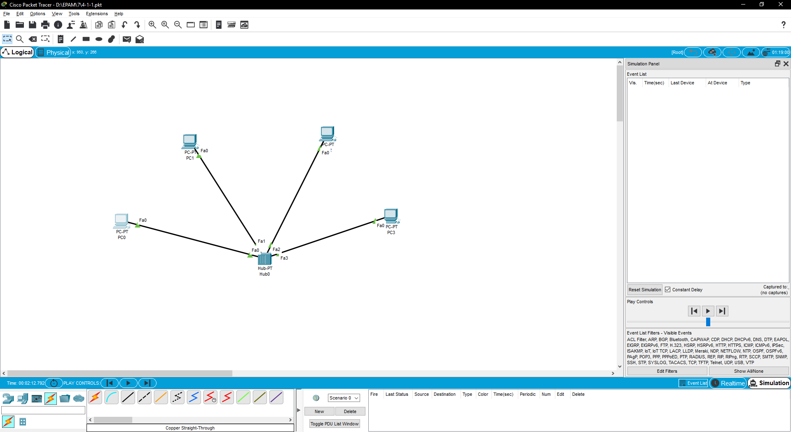
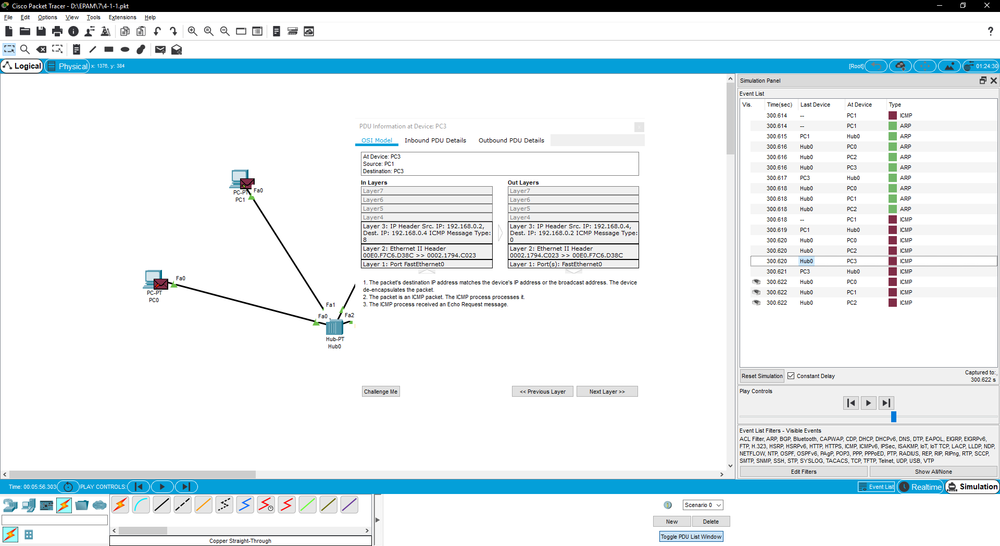
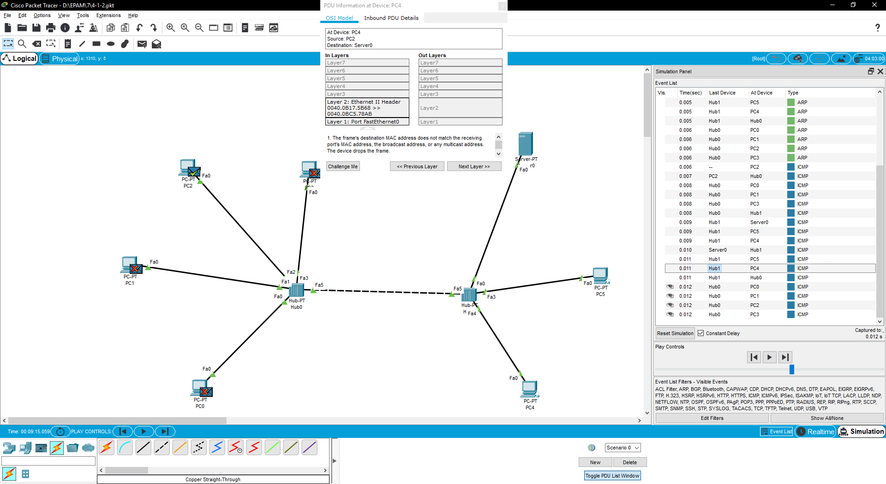
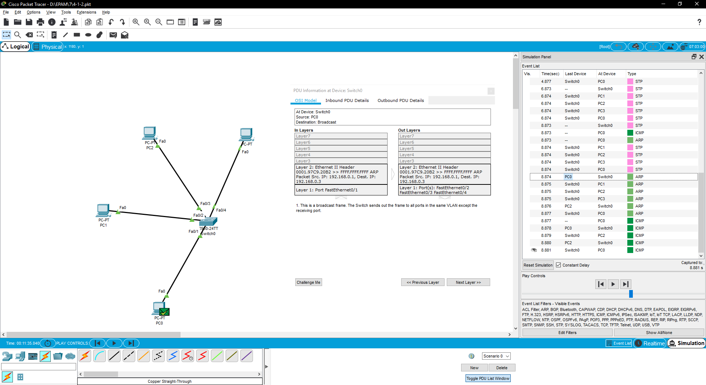
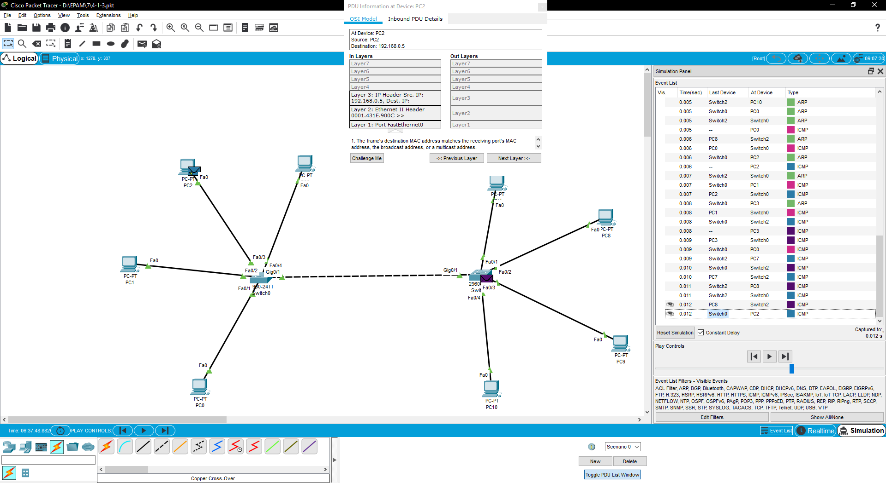
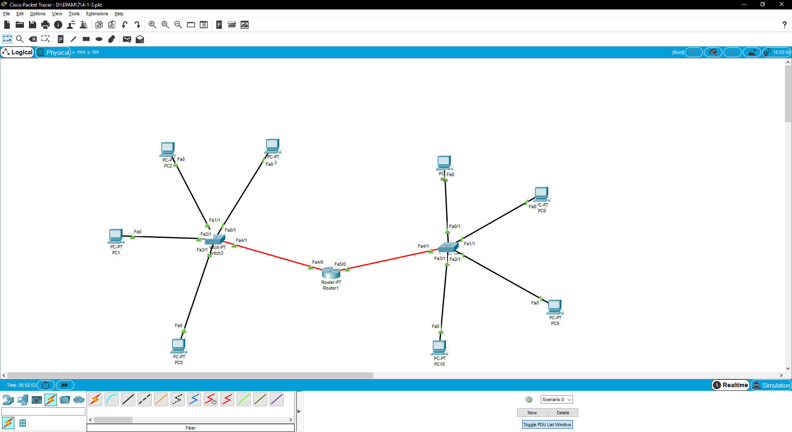
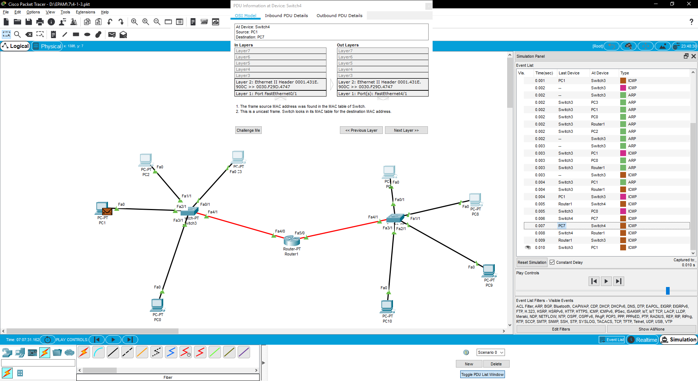
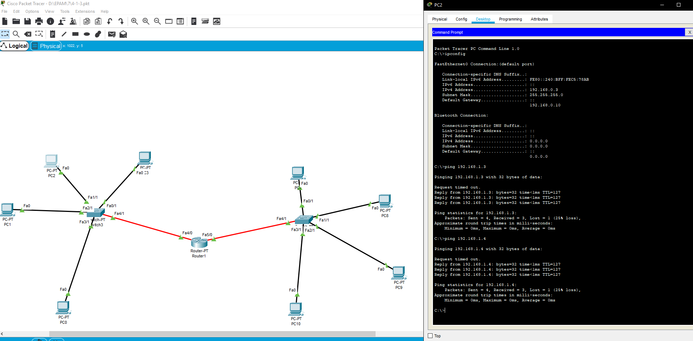

# TASK 4.1 #
------
### Network with Hub ###

Pic.1

Pic.2

PC0 - 192.168.0.1
PC1 - 192.168.0.2
PC2 - 192.168.0.3
PC3 - 192.168.0.4
### Network with two Hubs ###

Pic.3

PC0 - 192.168.0.1
PC1 - 192.168.0.2
PC2 - 192.168.0.3
PC3 - 192.168.0.4
PC4 - 192.168.0.6
PC5 - 192.168.0.7
Server - 192.168.0.5
### Network with Switch ###

Pic.4

PC0 - 192.168.0.1
PC1 - 192.168.0.2
PC2 - 192.168.0.3
PC3 - 192.168.0.4
### Network with two Switches ###

Pic.5

PC0 - 192.168.0.1
PC1 - 192.168.0.2
PC2 - 192.168.0.3
PC3 - 192.168.0.4
PC7 - 192.168.0.5
PC8 - 192.168.0.6
PC9 - 192.168.0.7
PC10 - 192.168.0.8
### Network with two Switches and Router ###

Pic.6

PC0 - 192.168.0.1
PC1 - 192.168.0.2
PC2 - 192.168.0.3
PC3 - 192.168.0.4
Default router - 192.168.0.10

PC7 - 192.168.1.1
PC8 - 192.168.1.2
PC9 - 192.168.1.3
PC10 - 192.168.1.4
Default router - 192.168.1.10

Pic.7

Pic.8
